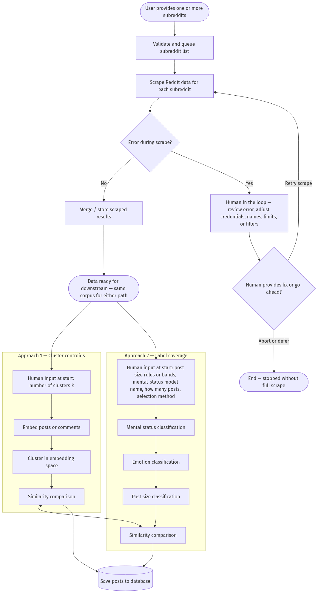

# Diversity-aware Reddit sampling

A Streamlit tool that scrapes a subreddit, saves the posts, then selects a diverse sample in two ways and scores each sample with [Vendi](https://arxiv.org/abs/2210.02410). Higher Vendi means the selected posts are more dissimilar in embedding space.

[Sample UI](reddit_data_process_ui/sample_ui.pdf) · [Pipeline workflow](reddit_data_process/reddit_data_pipline_workflow.png)



## Cluster centroids and label coverage

After a scrape, you choose a sample size *n* (10, 20, 50, or 100). Both methods return *n* posts from the same corpus. Vendi is then computed on the `selftext` embeddings of those selected posts so the two sets are comparable.

**Cluster centroids** embeds every post, partitions the corpus into *n* clusters, and keeps the post nearest each cluster center. The result is *n* representative posts spread across the semantic space of the subreddit.

**Label coverage** classifies every post for mental status, emotion, and length (small / medium / large `selftext`), then picks *n* posts that cover as many of those label combinations as possible. The result is *n* posts that spread across attributes rather than embedding clusters.

Use cluster centroids when you want geometric coverage of topics. Use label coverage when you want spread across clinical/affective labels and post size.

## Setup

From the repo root:

```bash
python -m pip install -r reddit_data_process_ui/requirements.txt
```

A CUDA build of PyTorch is optional. If a GPU is available the models use it; otherwise they fall back to CPU.

### `.env` credentials

Create a `.env` file in the **repo root** (same folder as this README). The app loads that file before talking to Reddit.

Required:

| Variable | Purpose |
|---|---|
| `REDDIT_CLIENT_ID` | Reddit app client ID |
| `REDDIT_CLIENT_SECRET` | Reddit app secret |
| `REDDIT_USER_AGENT` | A unique user-agent string for your script |

Optional:

| Variable | Purpose |
|---|---|
| `REDDIT_USERNAME` | Reddit login, if you want a script/password client |
| `REDDIT_PASSWORD` | Reddit password, used only with `REDDIT_USERNAME` |
| `HF_TOKEN` | Hugging Face token for downloading models (alias: `HUGGING_FACE_HUB_TOKEN`) |

Create a **script** app at [reddit.com/prefs/apps](https://www.reddit.com/prefs/apps) to get the client id and secret. A typical `.env` looks like:

```env
REDDIT_CLIENT_ID=your_client_id
REDDIT_CLIENT_SECRET=your_client_secret
REDDIT_USER_AGENT=diversity-aware-reddit-sampling/0.1 by your_username
```

Do not commit `.env`.

## Run the app

From the repo root:

```bash
python -m streamlit run reddit_data_process_ui/app.py
```

Or from the UI folder:

```bash
cd reddit_data_process_ui
python -m streamlit run app.py
```

On Windows you can also run `reddit_data_process_ui/run_ui.ps1`.

In the browser:

1. Enter a subreddit and scrape options, then **Scrape and save**. Posts are written under `data/` as `{subreddit}_{count}_raw.csv`.
2. Choose *n* and run **Cluster centroids** and/or **Label coverage**.
3. Compare Vendi scores, save or download the selected posts.

Embeddings are stored in `data/chroma` per subreddit and reused on later runs. Scrapes pause 60 seconds between batches of 100 listing items to stay within Reddit rate limits.
